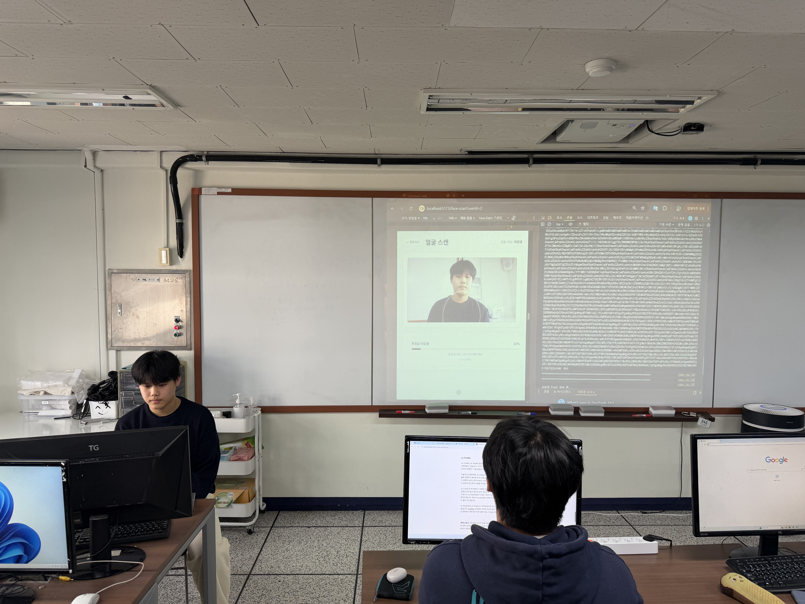

# PrivyFace

얼굴 인식과 영지식 증명(Zero-Knowledge Proof)을 결합한 프라이버시 보호 신원 인증 시스템입니다.

실제 얼굴 데이터를 노출하지 않고도 **"내가 정부 DB에 등록된 사람임"** 을 수학적으로 증명할 수 있습니다.



---

## 핵심 아이디어

기존 얼굴 인식은 서버에 얼굴 데이터를 전송해야 합니다. PrivyFace는 다릅니다.

- 얼굴 특징값은 디바이스 안에서만 처리 (Private Input)
- 서버에는 "일치한다/안 한다"는 결과와 수학적 증명만 전송
- ZK-SNARK를 통해 서버가 직접 데이터를 보지 않고도 검증 가능

---

## 동작 흐름

```
1. 유저 선택 (홈 화면)
        ↓
2. 웹캠으로 60프레임 수집 (MediaPipe)
        ↓
3. 468개 얼굴 랜드마크에서 10가지 기하학적 특징 추출
   (코 길이, 입 너비, 눈썹 간격 등 — 눈 사이 거리로 정규화)
        ↓
4. ZK-SNARK Proof 생성 (o1js)
   - Private: 실제 특징값, 정부 DB 특징값
   - Public: 유사도 결과 (1 = 통과 / 0 = 실패)
        ↓
5. Merkle Proof + Face ZK Proof를 서버로 전송
        ↓
6. 서버에서 검증 후 신원 인증 완료
```

---

## 기술 스택

| 분류 | 기술 |
|------|------|
| Frontend | React 19, TypeScript, Vite |
| 얼굴 인식 | MediaPipe Tasks Vision |
| ZKP | o1js (Mina Protocol) |
| 해시 | Poseidon Hash (circomlibjs) |
| 스타일 | SCSS Modules |

---

## 프로젝트 구조

```
src/
├── pages/
│   ├── Home/              # 유저 목록
│   └── FaceScan/          # 스캔 + Proof 생성
├── components/face-scan/
│   ├── VideoStream/       # 웹캠 + MediaPipe
│   ├── ScanProgress/      # 진행 상황 표시
│   └── FeatureDisplay/    # 추출된 특징값 표시
├── lib/
│   ├── mediapipe/         # 얼굴 감지기
│   ├── face-features/     # 특징 추출 / 정규화
│   └── zkp/
│       ├── circuits/      # ZK 회로 정의 (o1js ZkProgram)
│       ├── identity.manager.ts
│       └── config.ts
└── government/
    └── UserInfo.ts        # 정부 DB 시뮬레이션
```

---

## 실행 방법

```bash
npm install
npm run dev
```

백엔드 서버(`localhost:3000`)가 별도로 필요합니다.

---

## 관련 레포

- 백엔드: 별도 레포 운영
